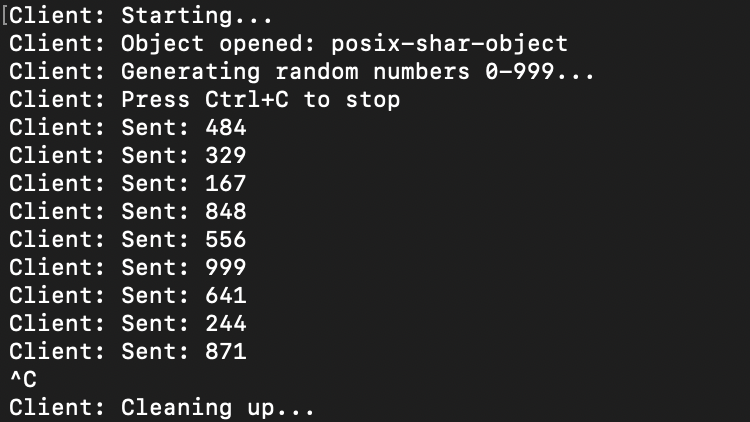
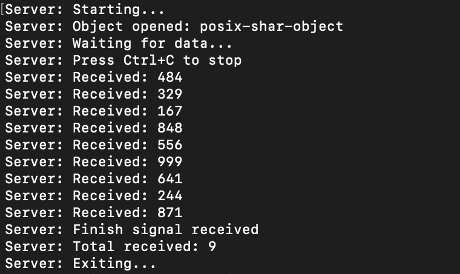
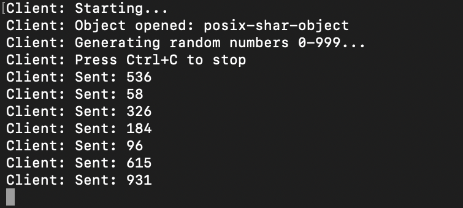
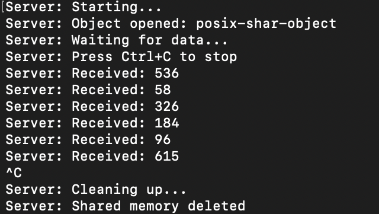

# Отчёт по домашней работе №8
Яровицына Наталья | БПИ244

## Выполненные требования

- [x] Разработаны независимые программы клиента и сервера
- [x] Взаимодействие через разделяемую память (POSIX shm)
- [x] Клиент генерирует случайные числа 0-999
- [x] Сервер выводит полученные данные
- [x] Реализовано корректное завершение работы
- [x] Удаление сегмента разделяемой памяти при завершении

## Способ завершения программы

**Способ:** Обработка сигнала SIGINT (Ctrl+C)

**Пояснение:**
- При нажатии Ctrl+C в клиенте: отправляет серверу сигнал завершения (MSG_TYPE_FINISH)
- При нажатии Ctrl+C в сервере: удаляет разделяемую память и завершает работу
- Оба процесса отслеживают состояние разделяемой памяти для синхронизации

## Принцип работы

1. Сервер создает разделяемую память и ожидает данные
2. Клиент подключается к памяти и отправляет случайные числа
3. Сервер читает числа и выводит их
4. При завершении через Ctrl+C память корректно освобождается

## Тестирование работы

### Тест 1: Штатное завершение через клиент
**Клиент:**

**Сервер:**

### Тест 2: Завершение через сервер  
**Клиент:**

**Сервер:**

