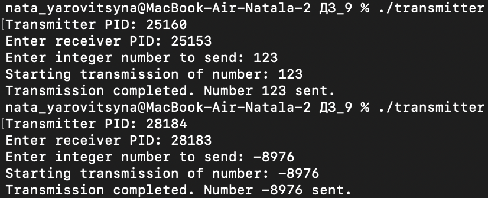
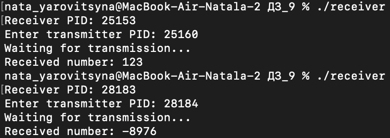

# Отчёт по домашней работе №9

## Описание работы программы

Программа состоит из двух компонентов, работающих в разных процессах:

### Передатчик (transmitter.c)
- Выводит свой PID и запрашивает PID приемника
- Запрашивает целое число для передачи (может быть отрицательным)
- Побитово передает число используя сигналы:
  - SIGUSR1 - передача бита 0
  - SIGUSR2 - передача бита 1
- Ожидает подтверждение получения каждого бита
- После передачи всех 32 битов отправляет сигнал SIGINT для завершения

### Приемник (receiver.c)
- Выводит свой PID и запрашивает PID передатчика
- Ожидает сигналы и собирает переданное число побитово
- На каждый полученный бит отправляет подтверждение
- После получения сигнала завершения выводит принятое число

## Выполненные требования

- [x] Побитовая передача числа
- [x] Использование SIGUSR1/SIGUSR2 для кодирования битов
- [x] Передача целых чисел (положительных и отрицательных)
- [x] Вывод принятого числа в десятичной системе
- [x] Ввод PID программ-собеседников
- [x] Передача информации с задержкой
- [x] Асинхронная передача

## Результаты тестирования

