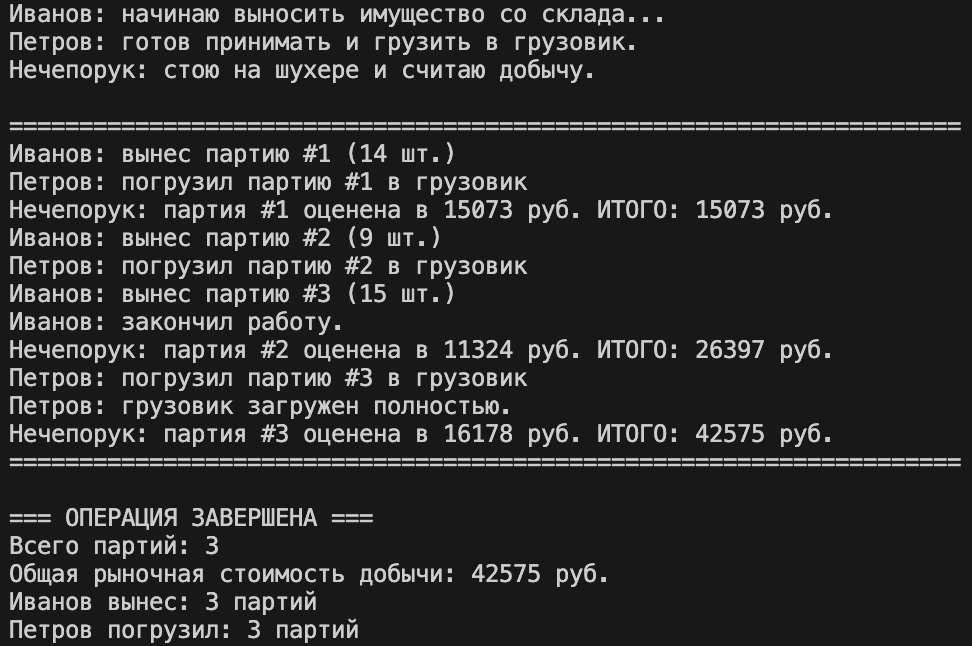
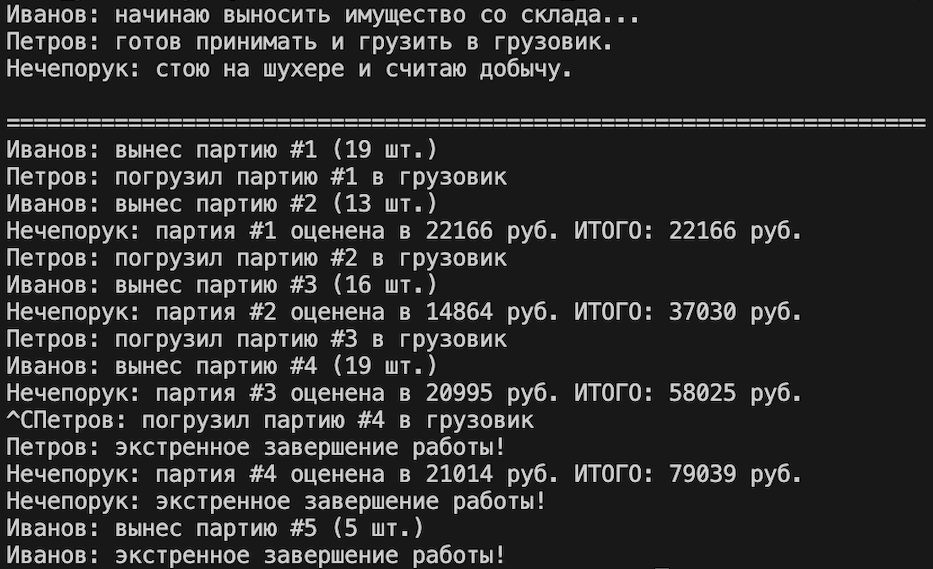
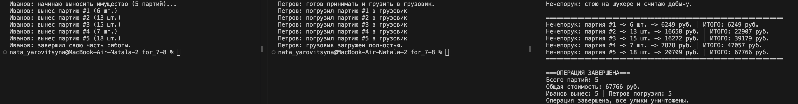
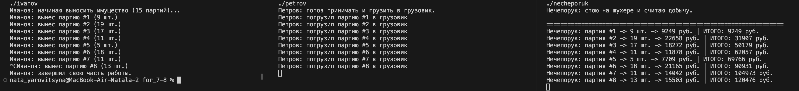
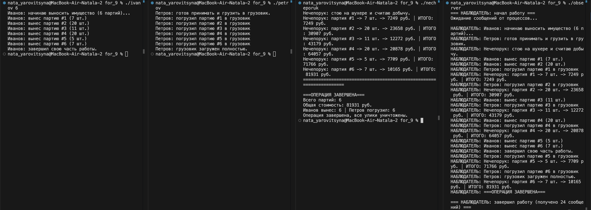
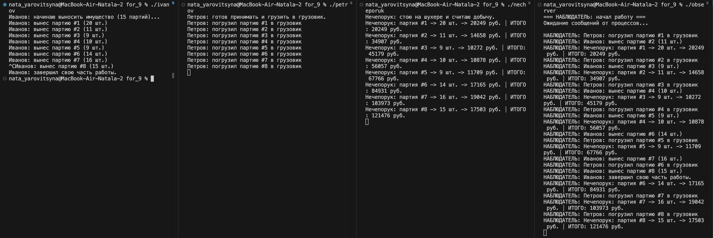

# Отчет по индивидуальному заданию №3
Яровицына Наталья | БПИ244

### Вариант задания и условие задачи

**Вариант 30:** Военная операция

Темной-темной ночью прапорщики Иванов, Петров и Нечепорук занимаются хищением военного имущества со склада родной военной части. Будучи умными людьми и отличниками боевой и строевой подготовки, прапорщики ввели разделение труда. Иванов выносит имущество со склада и передает его в руки Петрову, который грузит его в грузовик. Нечепорук стоит на шухере и заодно подсчитывает рыночную стоимость добычи после погрузки в грузовик очередной партии похищенного.

**Требование:** Составить многопроцессное приложение, моделирующее деятельность прапорщиков-потоков. Необходимо учесть случайное время выполнения каждым прапорщиком своей боевой задачи и организовать в программе корректную их синхронизацию.

### Решение на 4-6 баллов

#### Сценарий решаемой задачи

**Отображение сущностей в процессы:**
- Иванов - процесс выноса имущества со склада
- Петров - процесс погрузки в грузовик  
- Нечепорук - процесс оценки стоимости

**Взаимодействие процессов:**
1. Иванов выносит партию -> сигнал Петрову
2. Петров грузит в грузовик -> сигнал Нечепоруку
3. Нечепорук оценивает стоимость -> цикл повторяется

**Синхронизация:**
- Используются три семафора для координации действий
- Разделяемая память для обмена данными между процессами
- Мьютекс для защиты критических секций

#### Выполненные требования на 4-6 баллов

- [x] Единый родительский процесс с дочерними процессами  
- [x] Неименованные POSIX семафоры для синхронизации  
- [x] Разделяемая память POSIX для обмена данными  
- [x] Корректное завершение по SIGINT (Ctrl+C)  
- [x] Информативный вывод работы каждого процесса  
- [x] Очистка семафоров и разделяемой памяти

#### Способ запуска программы

```bash
# Компиляция и запуск с указанием количества партий
gcc -o military_theft military_theft.c -lpthread -lrt && ./military_theft 10»

# Компиляция и запуск с указанием количества партий через Docker Desktop
docker run --rm -v ${PWD}:/app -w /app gcc:latest bash -c "gcc -o military_theft military_theft.c -lpthread -lrt && stdbuf -o0 ./military_theft 10"

# Запуск с количеством партий по умолчанию (15)
gcc -o military_theft military_theft.c -lpthread -lrt && ./military_theft»

# Запуск с количеством партий по умолчанию (15) через Docker Desktop
docker run --rm -v ${PWD}:/app -w /app gcc:latest bash -c "gcc -o military_theft military_theft.c -lpthread -lrt && stdbuf -o0 ./military_theft"
```

**Параметры:**
- Количество партий передается как аргумент командной строки
- По умолчанию обрабатывается 15 партий
- Максимальное количество партий - 100

#### Результаты работы программы
Тест 1: Корректная работа программы



Тест 2: Принудительное завершение



### Решение на 7-8 баллов

#### Сценарий решаемой задачи

**Отображение сущностей в независимые процессы:**
- **Иванов** - независимый процесс выноса имущества со склада
- **Петров** - независимый процесс погрузки в грузовик  
- **Нечепорук** - независимый процесс оценки стоимости и подведения итогов

**Взаимодействие процессов:**
1. Иванов выносит партию со склада (1.5-3 сек) -> сохраняет данные в разделяемую память -> сигнал Петрову через семафор
2. Петров получает сигнал -> загружает партию в грузовик (1-2 сек) -> сигнал Нечепоруку через семафор
3. Нечепорук получает сигнал -> оценивает стоимость партии (0.5-1 сек) -> выводит текущий итог
4. Цикл повторяется для всех партий

**Синхронизация:**
- Используются три именованных семафора для координации действий:
  - SEM_MUTEX - защита критических секций в разделяемой памяти
  - SEM_IVANOV - сигнал от Иванова к Петрову
  - SEM_PETROV - сигнал от Петрова к Нечепоруку
- Разделяемая память POSIX для обмена данными между процессами
Все процессы работают независимо в разных консолях

#### Особенности реализации

- **Иванов** создает и инициализирует все разделяемые ресурсы (память и семафоры)
- **Петров** и **Нечепорук** подключаются к уже существующим ресурсам
- **Нечепорук** выполняет финальную очистку всех POSIX-объектов
- Используется массив party_sizes[] для хранения размеров всех партий для последующего учета

#### Выполненные требования на 7-8 баллов

- [x] **Независимые процессы**, запускаемые в разных консолях
- [x] **Именованные POSIX семафоры** для синхронизации между независимыми процессами
- [x] **Разделяемая память POSIX** для обмена данными между независимыми процессами
- [x] **Корректное завершение по SIGINT/SIGTERM** с обработчиками сигналов в каждом процессе
- [x] **Информативный вывод в свои консоли** каждого процесса согласно их ролевым функциям
- [x] **Очистка семафоров и разделяемой памяти** при завершении через Нечепорука
- [x] **Случайные временные задержки** для имитации реальной работы

#### Способ запуска программы

**Порядок запуска важен:**
1. Сначала запустить Иванова (создает ресурсы)
2. Затем запустить Петрова (подключается к ресурсам)  
3. Наконец запустить Нечепорука (подключается к ресурсам)

```bash
# Компиляция всех программ
gcc -o ivanov ivanov.c common.c -lpthread -lrt
gcc -o petrov petrov.c common.c -lpthread -lrt  
gcc -o necheporuk necheporuk.c common.c -lpthread -lrt

# Запуск в разных консолях (ПОРЯДОК ВАЖЕН!):

# Консоль 1 - Иванов (с указанием количества партий)
./ivanov 10

# Консоль 2 - Петров (без аргументов)
./petrov

# Консоль 3 - Нечепорук (без аргументов)  
./necheporuk
```
#### Результаты работы программы

Тест 1: Корректная работа программы



Тест 2: Принудительное завершение



### Решение на 9 баллов

#### Сценарий решаемой задачи

**Отображение сущностей в независимые процессы:**
- **Наблюдатель** - независимый процесс интеграции и отображения всей информации

**Взаимодействие процессов:**
1. Иванов выносит партию со склада (1.5-3 сек) -> сохраняет данные в разделяемую память -> сигнал Петрову через семафор -> отправка сообщения наблюдателю
2. Петров получает сигнал -> загружает партию в грузовик (1-2 сек) -> сигнал Нечепоруку через семафор -> отправка сообщения наблюдателю
3. Нечепорук получает сигнал -> оценивает стоимость партии (0.5-1 сек) -> выводит текущий итог -> отправка сообщения наблюдателю
4. Наблюдатель получает все сообщения через именованный канал -> выводит единую картину операции
5. Цикл повторяется для всех партий

**Синхронизация и коммуникация:**
- Используются три именованных семафора для координации действий:
  - SEM_MUTEX - защита критических секций в разделяемой памяти
  - SEM_IVANOV - сигнал от Иванова к Петрову
  - SEM_PETROV - сигнал от Петрова к Нечепоруку
- Разделяемая память POSIX для обмена данными между процессами
- Именованный канал (FIFO) для передачи информации наблюдателю
- Все процессы работают независимо в разных консолях

#### Особенности реализации
- **Наблюдатель** создает именованный канал и получает сообщения от всех процессов
- **Двойной вывод информации**: каждый процесс выводит в свою консоль + отправляет данные наблюдателю

#### Выполненные требования на 9 баллов

- [x] **Процесс-наблюдатель** интегрирует и корректно отображает всю информацию
- [x] **Все процессы запускаются независимо** друг от друга
- [x] **Именованный канал (FIFO)** для коммуникации с наблюдателем
- [x] **Двойной вывод информации** - в свою консоль и наблюдателю

#### Способ запуска программы

**Рекомендуемый порядок запуска:**
1. Запустить Наблюдателя (можно в начале или в конце)
2. Запустить Иванова (обязательно первым из рабочих процессов)
3. Запустить Петрова
4. Запустить Нечепорука

```bash
# Компиляция всех программ
gcc -o ivanov ivanov.c common.c -lpthread -lrt
gcc -o petrov petrov.c common.c -lpthread -lrt  
gcc -o necheporuk necheporuk.c common.c -lpthread -lrt
gcc -o observer observer.c common.c -lpthread -lrt

# Запуск в разных консолях:

# Консоль 1 - Наблюдатель (рекомендуется запускать первым)
./observer

# Консоль 2 - Иванов (с указанием количества партий)
./ivanov 10

# Консоль 3 - Петров (без аргументов)
./petrov

# Консоль 4 - Нечепорук (без аргументов)  
./necheporuk
```

**Альтернативный вариант запуска:**
```bash
# Наблюдатель можно запустить и после начала работы прапорщиков
./ivanov 10
./petrov
./necheporuk
./observer 
```

#### Результаты работы программы

Тест 1: Корректная работа программы



Тест 2: Принудительное завершение


